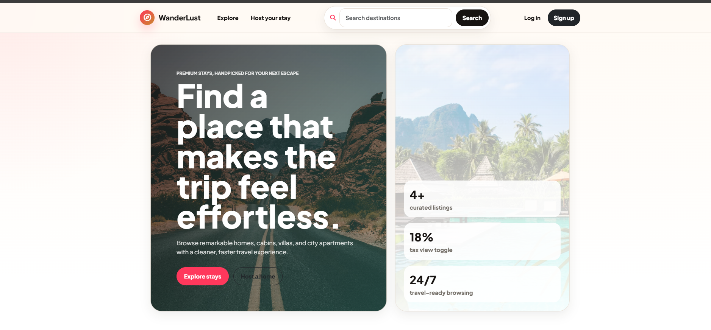
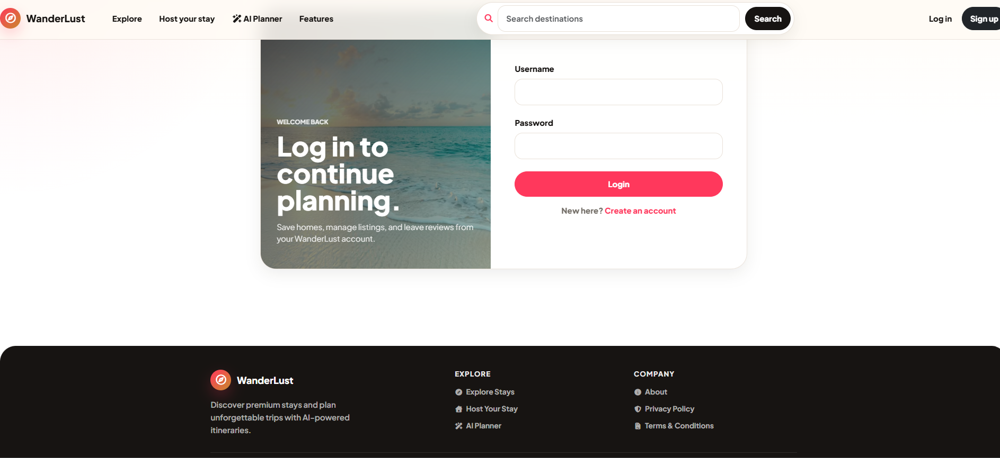
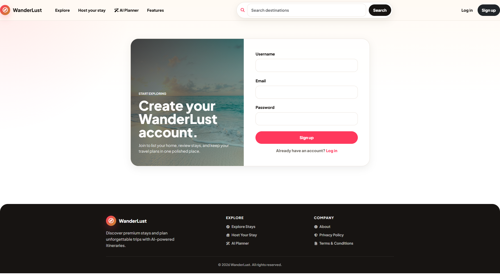
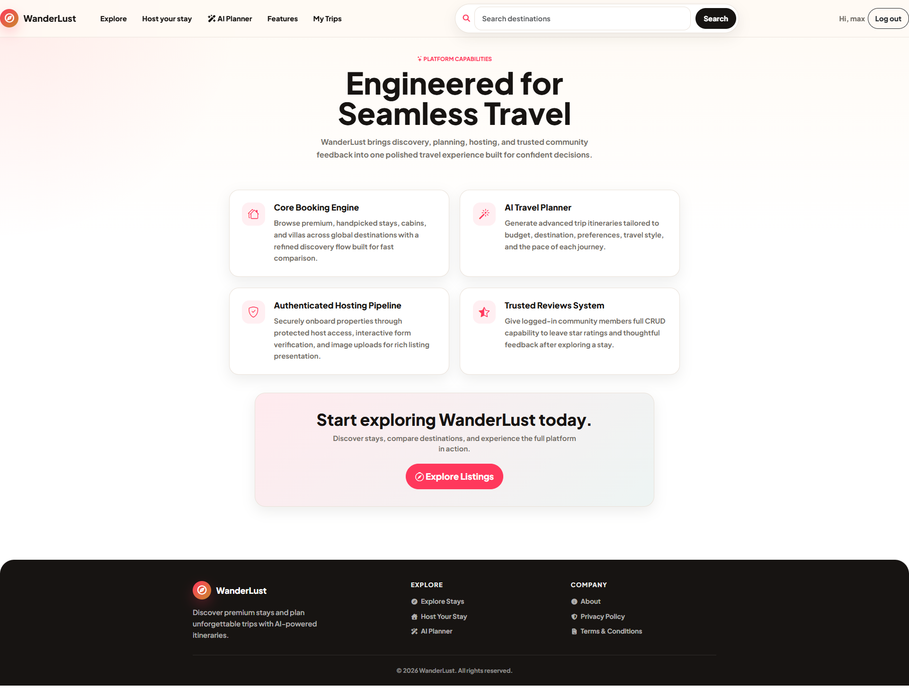

# 🌍 WanderLust AI – Smart Travel & Accommodation Platform

WanderLust AI is a modern full-stack travel platform inspired by Airbnb that combines accommodation discovery with AI-powered trip planning. Users can explore destinations, create and manage listings, upload property images, leave reviews, view locations on interactive maps, and generate personalized travel itineraries using TripMind AI.

---

# 🚀 Live Demo

🌐 Live Website: https://wanderlust-fhqc.onrender.com/listings

📂 GitHub Repository: https://github.com/mayanksuri21/WanderLust-

---

# ✨ Key Features

## 👤 Authentication & Authorization

* Secure user registration and login
* Passport.js authentication
* Session management with Express Session
* Persistent login sessions using Connect-Mongo
* Protected routes and ownership verification
* Flash messages for user feedback

---

## 🏡 Property Listing Management

* Create travel accommodation listings
* Edit and update listings
* Delete listings
* View detailed property information
* Ownership-based access control
* Responsive listing cards and layouts

---

## 📸 Cloud Image Management

* Upload property images
* Cloudinary integration
* Optimized image delivery
* Secure cloud storage
* Automatic image handling

---

## 🗺️ Interactive Maps & Location Intelligence

* Mapbox integration
* Interactive destination maps
* Geocoding support
* Location-based visualization
* Real-time map rendering for listings

---

## ⭐ Reviews & Ratings

* Add reviews for listings
* Rating system
* Delete reviews
* User-generated feedback system
* Enhanced trust and credibility

---

## 🤖 TripMind AI Planner

### AI-Powered Travel Planning

TripMind AI transforms WanderLust from a simple accommodation platform into a complete travel companion.

Users can:

* Generate personalized travel itineraries
* Plan trips based on destination and duration
* Receive day-wise travel suggestions
* Discover attractions and activities
* Save AI-generated itineraries
* Access trip plans anytime

### Why TripMind AI?

Instead of manually researching destinations, users can generate a structured travel plan within seconds, helping them:

* Save planning time
* Discover hidden attractions
* Organize trips efficiently
* Improve travel experiences

---

## 🎨 Modern User Experience

* Responsive design
* Bootstrap 5 UI
* Mobile-friendly interface
* Clean navigation
* Modern card layouts
* Interactive forms
* Optimized user flow

---

# 🛠️ Tech Stack

## Frontend

* HTML5
* CSS3
* JavaScript
* Bootstrap 5
* EJS

## Backend

* Node.js
* Express.js

## Database

* MongoDB Atlas
* Mongoose

## Authentication

* Passport.js
* Express Session
* Connect-Mongo

## Cloud Services

* Cloudinary
* Mapbox

## AI Integration

* TripMind AI Planner
* AI-based itinerary generation

## Deployment

* Render

---

# 🏗️ Project Architecture

```text
                        ┌─────────────────────┐
                        │      Users          │
                        └──────────┬──────────┘
                                   │
                                   ▼
                     ┌─────────────────────────┐
                     │      EJS Frontend       │
                     └──────────┬──────────────┘
                                │
                                ▼
                     ┌─────────────────────────┐
                     │    Express.js Server    │
                     └──────────┬──────────────┘
                                │
           ┌────────────────────┼────────────────────┐
           ▼                    ▼                    ▼

    MongoDB Atlas         Cloudinary           Mapbox API
 (Listings & Users)      (Image Storage)     (Maps & GeoData)

                                │
                                ▼

                      ┌─────────────────┐
                      │  TripMind AI    │
                      │ Travel Planner  │
                      └─────────────────┘
```

---

# 📁 Project Structure

```text
WanderLust-AI/
│
├── MODELS/
│   ├── Listing.js
│   ├── Review.js
│   ├── User.js
│   └── Trip.js
│
├── controllers/
│   ├── listings.js
│   ├── reviews.js
│   ├── users.js
│   └── plannerController.js
│
├── routes/
│   ├── listings.js
│   ├── reviews.js
│   ├── users.js
│   └── planner.js
│
├── views/
│   ├── listings/
│   ├── users/
│   ├── planner/
│   └── layouts/
│
├── public/
│   ├── css/
│   ├── js/
│   └── images/
│
├── middleware.js
├── cloudConfig.js
├── app.js
├── package.json
└── README.md
```

---

# ⚙️ Installation & Setup

## Clone Repository

```bash
git clone https://github.com/mayanksuri21/WanderLust-.git
```

## Navigate to Project

```bash
cd WanderLust-
```

## Install Dependencies

```bash
npm install
```

## Create Environment File

Create a `.env` file in the root directory:

```env
ATLASDB_URL=your_mongodb_connection_string

CLOUD_NAME=your_cloudinary_cloud_name
CLOUD_API_KEY=your_cloudinary_api_key
CLOUD_API_SECRET=your_cloudinary_api_secret

MAP_TOKEN=your_mapbox_access_token

SECRET=your_session_secret

OPENAI_API_KEY=your_openai_api_key
```

## Start Development Server

```bash
npm start
```

Application runs at:

```text
http://localhost:8080
```

---

# 📸 Application Screenshots

## Home Page



## Login



## Sign-up



## Create Listing


## Listing Details


## Edit & Delete Listing


## Features



## AI Planner


## Saved Trips


## TripMind AI Planner

Add screenshots of:

* AI Planner Page
* Generated Itinerary
* Saved Trips Dashboard

---

# 🎯 Real-World Problems Solved

### For Travelers

* Simplifies accommodation discovery
* Helps users plan complete trips
* Reduces travel research effort
* Centralizes travel planning

### For Hosts

* Easy property listing management
* Rich media support
* Location visibility through maps
* Community-driven reviews

### Through AI

* Generates personalized itineraries
* Organizes travel schedules
* Enhances travel decision-making
* Improves user engagement

---

# 📚 What I Learned

* Building scalable MVC applications
* RESTful routing and CRUD operations
* Authentication and authorization
* Session management
* Cloudinary integration
* MongoDB data modeling
* Mapbox geolocation services
* AI feature integration in existing products
* Production deployment on Render
* Full-stack application architecture
* Real-world software engineering workflows using Git and GitHub

---

# 🔮 Future Roadmap

* ❤️ Wishlist & Favorites
* 🔍 Smart Search Filters
* 📅 Booking Management System
* 💳 Payment Gateway Integration
* 📧 Email Notifications
* 🌙 Dark Mode
* 📱 Progressive Web App (PWA)
* 🌐 Multi-language Support
* 🧠 Advanced AI Recommendations
* 📊 Travel Analytics Dashboard

---

# ⚠️ Environment Variables

This project uses sensitive API keys and credentials.

Never commit:

```text
.env
```

to GitHub.

Always add it to:

```text
.gitignore
```

---

# 👨‍💻 Developer

**Mayank Suri**

B.Tech Information Technology

GitHub: https://github.com/mayanksuri21

---

# ⭐ Support the Project

If you like this project and found it useful, consider giving it a ⭐ on GitHub.

Your support motivates further development and helps the project reach more developers.
