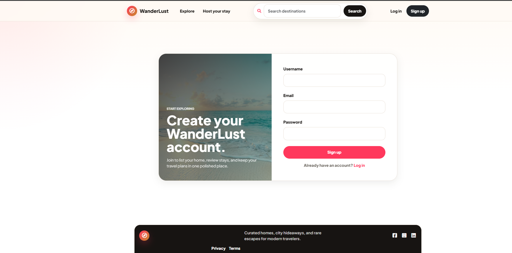
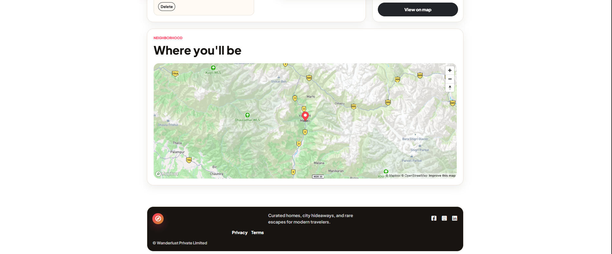
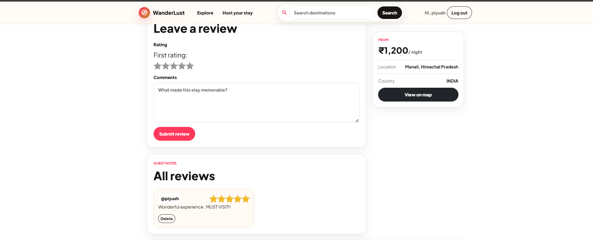

# 🌍 WanderLust

A modern full-stack travel accommodation platform inspired by Airbnb. WanderLust allows users to discover destinations, create and manage property listings, upload images, write reviews, and explore locations on an interactive map.

---

## 🚀 Live Demo

🌐 **Live Website:** [https://wanderlust-nya1.onrender.com/listings](https://wanderlust-fhqc.onrender.com/listings)

---

## ✨ Features

### 👤 User Authentication

* Secure Sign Up & Login
* Session-based authentication using Passport.js
* Protected routes
* Flash messages for user feedback

### 🏡 Listing Management

* Create new listings
* Edit existing listings
* Delete listings
* View complete listing details
* Responsive listing cards

### 📸 Image Uploads

* Upload property images
* Cloudinary image hosting
* Image preview support

### 🗺️ Interactive Maps

* Mapbox integration
* Geocoding support
* Display listing location on an interactive map

### ⭐ Reviews & Ratings

* Add reviews
* Delete reviews
* Rating system for listings

### 🎨 Modern UI

* Responsive design
* Bootstrap 5 interface
* Mobile-friendly layout
* Attractive cards and forms
* Clean navigation bar

---

# 🛠 Tech Stack

## Frontend

* HTML5
* CSS3
* JavaScript
* Bootstrap 5
* EJS

## Backend

* Node.js
* Express.js

## Database

* MongoDB Atlas
* Mongoose

## Authentication

* Passport.js
* Express Session
* Connect-Mongo

## Cloud Services

* Cloudinary
* Mapbox

---

# 🏗 Project Structure

```text
WanderLust
│
├── MODELS/
├── controllers/
├── routes/
├── public/
│   ├── css/
│   ├── js/
│   └── images/
├── screenshots/
├── views/
├── middleware.js
├── cloudConfig.js
├── app.js
├── package.json
└── README.md
```

---

# ⚙️ Installation

### Clone the repository

```bash
git clone https://github.com/mayanksuri21/WanderLust-.git
```

### Navigate into the project

```bash
cd WanderLust-
```

### Install dependencies

```bash
npm install
```

### Create a `.env` file

```env
ATLASDB_URL=your_mongodb_connection_string

CLOUD_NAME=your_cloudinary_cloud_name
CLOUD_API_KEY=your_cloudinary_api_key
CLOUD_API_SECRET=your_cloudinary_api_secret

MAP_TOKEN=your_mapbox_access_token

SECRET=your_session_secret
```

### Start the application

```bash
npm start
```

Visit:

```text
http://localhost:8080
```

---

### 📸 Screenshots

* **Home**


* **Login / SignUp**


* **Create Listing**


* **All Listings**


* **Map View**


* **Reviews**

---


# 🏗 Application Architecture

```text
Client (EJS Views)
        │
        ▼
Express.js Server
        │
        ▼
MongoDB Atlas Database
        │
 ┌──────┴────────┐
 ▼               ▼
Cloudinary     Mapbox
(Image Upload) (Maps & Geocoding)
```

---

# 📚 What I Learned

* Building a full-stack web application using the MVC architecture.
* Implementing secure authentication with Passport.js.
* Managing user sessions using Express Session and Connect-Mongo.
* Uploading and managing images with Cloudinary.
* Integrating Mapbox for maps and geolocation.
* Designing responsive user interfaces with Bootstrap.
* Deploying a production-ready application on Render.
* Managing environment variables securely using `.env`.

---

# 🔮 Future Enhancements

* ❤️ Wishlist/Favorites
* 🤖 AI Trip Planner
* 🔍 Smart Search & Filters
* 🌙 Dark Mode
* 📅 Booking System
* 💳 Payment Gateway Integration
* 📱 Progressive Web App (PWA)
* 🔔 Email Notifications

---

# ⚠️ Environment Variables

This project requires a `.env` file for API keys and sensitive credentials.

Never commit your `.env` file to GitHub.

---

# 👨‍💻 Author

**Mayank Suri**

GitHub: https://github.com/mayanksuri21

---

# ⭐ Support

If you found this project helpful, please consider giving it a **⭐ Star** on GitHub!
